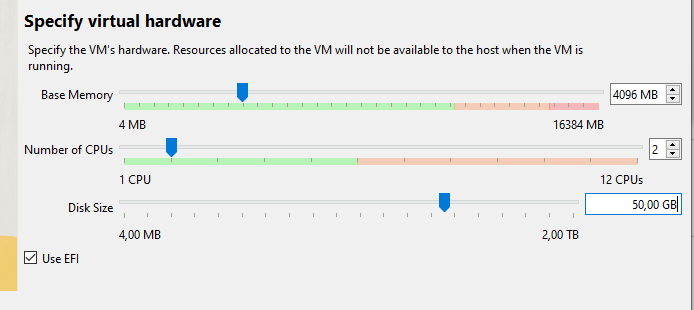
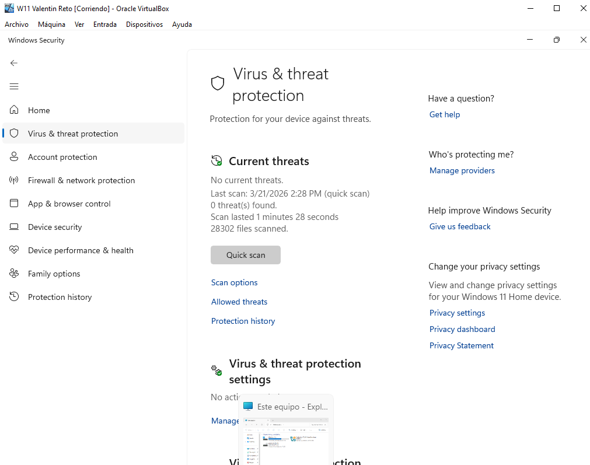
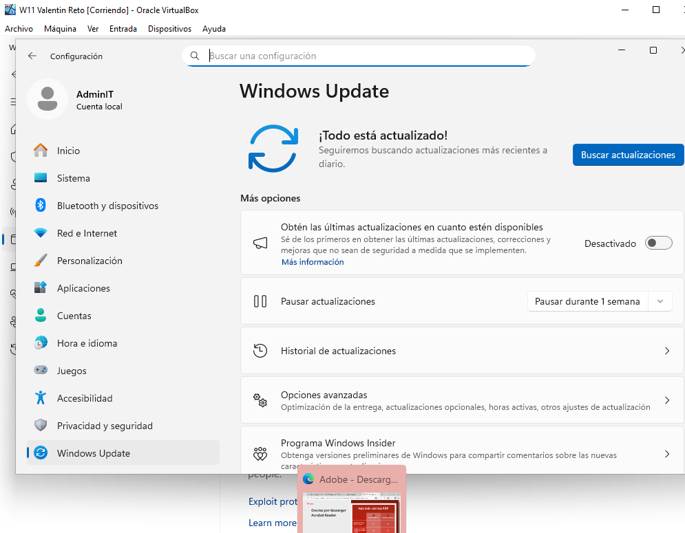

# Reto-01---RA2---UT4

**Proyecto: Preparación de PC de Oficina - Valentin Andriyash Andriiash**

**Ejercicio 1: Entorno Virtual** 
Hipervisor: VirtualBox. 
Recursos: 4GB RAM / 2 CPUs / 50GB Disco (Justificado por los 8GB del host). 
SO: Windows 11 Home. 
 

**Ejercicio 2: Software de Oficina** 
Google Chrome: Navegador principal para Google.  
7-Zip: Gestión de archivos comprimidos. 
Adobe Reader: Lector de PDF. 
 
 
 
**Ejercicio 3: Seguridad y Mantenimiento** 
Antivirus: Microsoft Defender. 
Mantenimiento: Instalación de Guest Additions para rendimiento óptimo. Tambien utilio HWMonitor para ver las temperaturas y voltajes de la CPU virtual. 
Pruebas: Verificación de acceso a Gmail y Google Docs. 
 
 

**Pruebas realizadas:**
Creacion de doc
Meter ese mismo doc a carpeta y comprimirla en 7zip

**Registro de Incidencias:**
Fallo de arranque: Error VERR_PATH_NOT_FOUND. Solución: Se eliminó el archivo .viso

**Mejoras Futuras** 
Ampliación de RAM: Subir a 8GB en la VM para mejorar la multitarea pesada. 
Automatización: Configurar tareas de limpieza de archivos temporales cada semana. 
Backup: Implementar una copia de seguridad automática de la unidad a un servidor externo. 

**Los pasos seguidos para instalar Windows:** 
1.Instalar .iso de w11 
2.Meter .iso en virtualbox y configurar ram, cpus y almacenamiento 
3.Abrir y configurar todo desde w11 

**Conclusión Final** 
El equipo ha sido configurado siguiendo los requerimientos de la empresa. Despues de las pruebas, se confirma que el sistema es estable, seguro y permite trabajar de forma fluida con las herramientas de Google.
