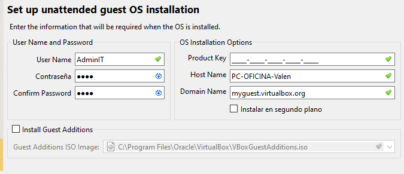
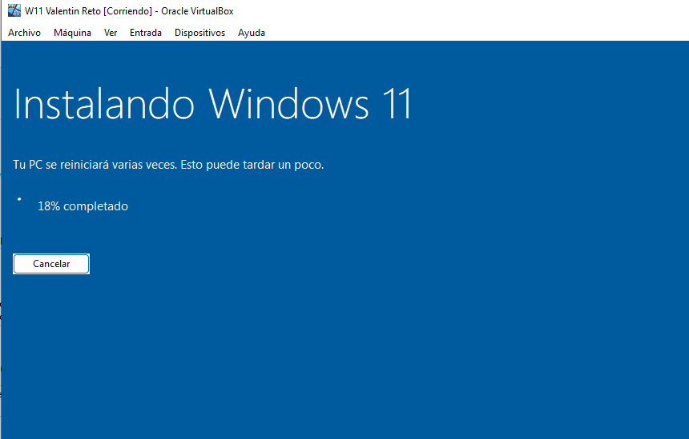
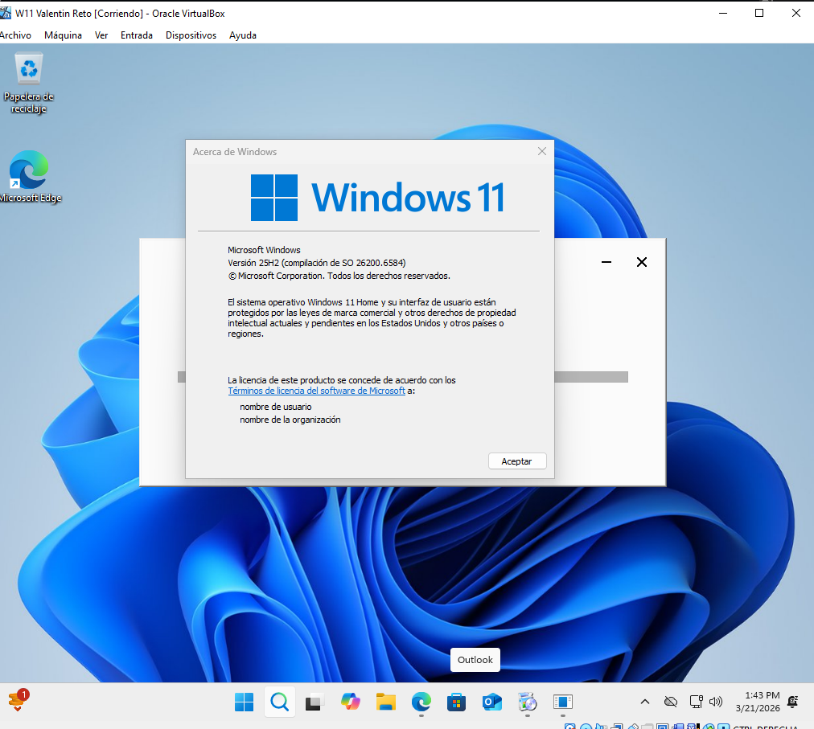

**EJERCICIO 1. Creación del entorno virtual e instalación de Windows.**

Crea una máquina virtual que simule un ordenador de oficina. Debes configurar de forma razonable la memoria RAM, procesador, disco duro virtual y conexión de red. Después, instala Windows y realiza la configuración inicial del sistema.

He elegido 4gb de ram ya que es un buen puento para oficina y se puede añadir mas en un futuro pero para un entorno de oficina en el que vaya a tener chrome con varias pestañas de docs y pdfs es suficiente. 
He elegido 50GB de almacenamiento ya que es lo sufuciente para el SO y el software esencial.
He elegido 2 nucleos ya que un Windows moderno requiere al menos 2 núcleos para gestionar procesos en segundo plano y que no se congelen las cosas mientras alguien trabaja. 
 
El user admin esta destinado a tareas de mantenimiento, instalación de software y configuración del sistema y el user estandar es el perfil de uso diario

  
He elegido la version 25H2 por ser una de las mas recientes y estable en 2026.

