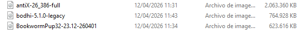

**Objetivo**
El objetoivo principal ha sido preparar un USB booteable con Ventoy e incluir 3 ISOs Linux

**Material utilizado**
HP cp7800
USB con software Ventoy
ISOs: antiX Linux, Bodhi Linux, Puppy Linux

**Verificacion**
Arranque desde usb
Menu ventoy visible
