# INSTALACION 
**Equipo utilziado**  
HP Compaq dc7800 

**Configuracion inicial** 
Acceso a BIOS 
Cambio de orden de arranque (USB primero) 

**Orden de intento de ISOs** 
Primero probamos el puppy linux, funcionaba perfectamente y el sigueinte dia en el taller parece que fallo el ventoy y no iba , entonces probamos con un rufus de otro compañero y funcionaba, eligimos antiX. Ademas, instalamos mx linux en otro ordernador para probarlo, tambien funcionaba 

**Resultado final** 
Sistemas instalados: puppy linux, antiX Linux y MX linux 
Funcionaron correctamente 

 
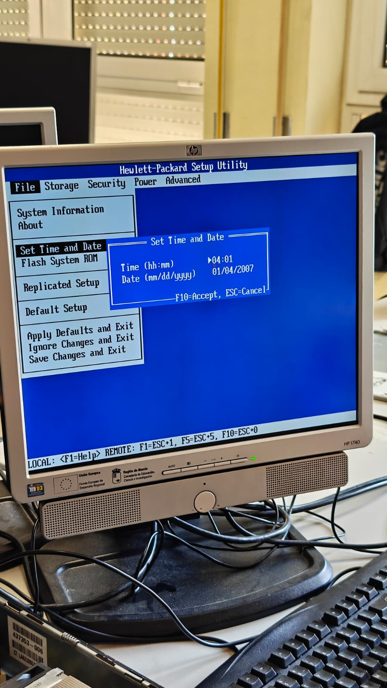 
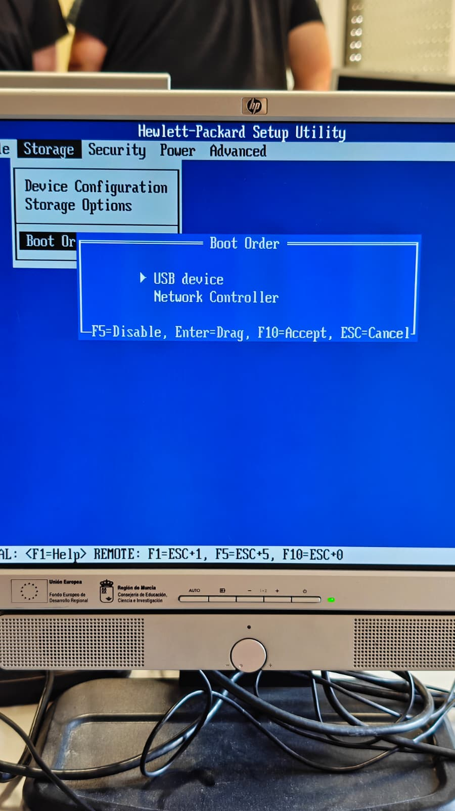 
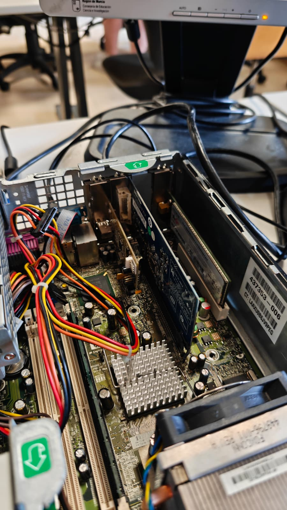 
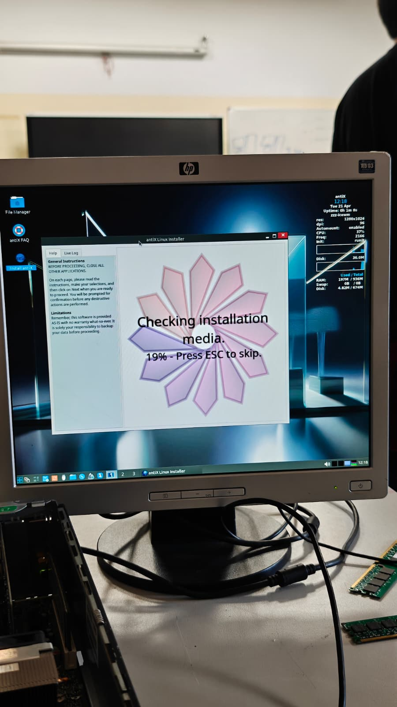 
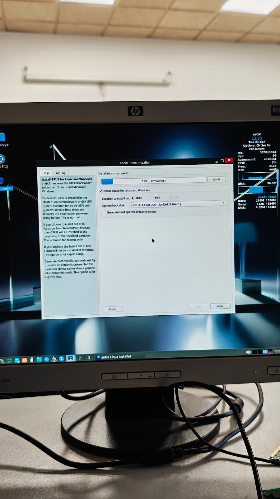 
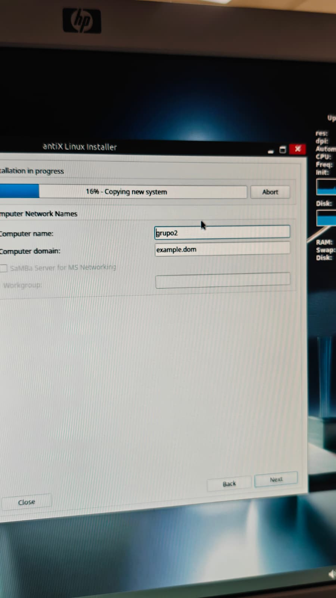 
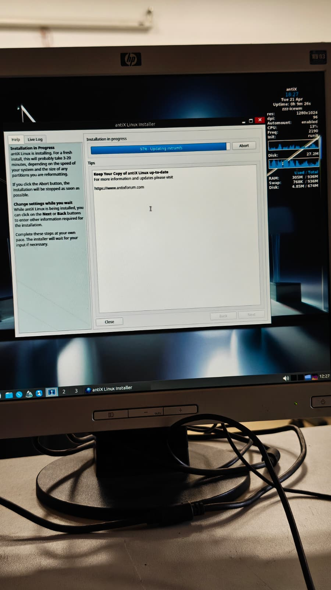 
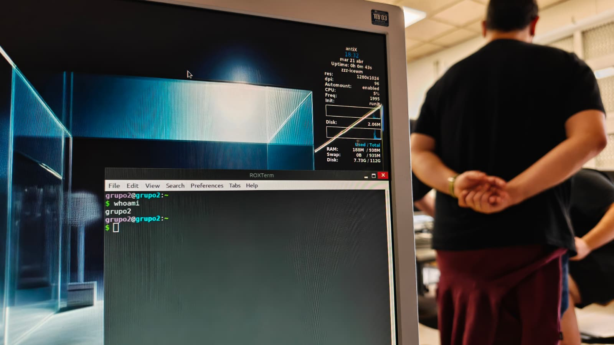 
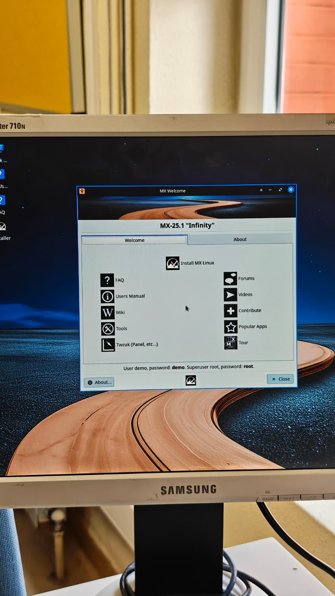 
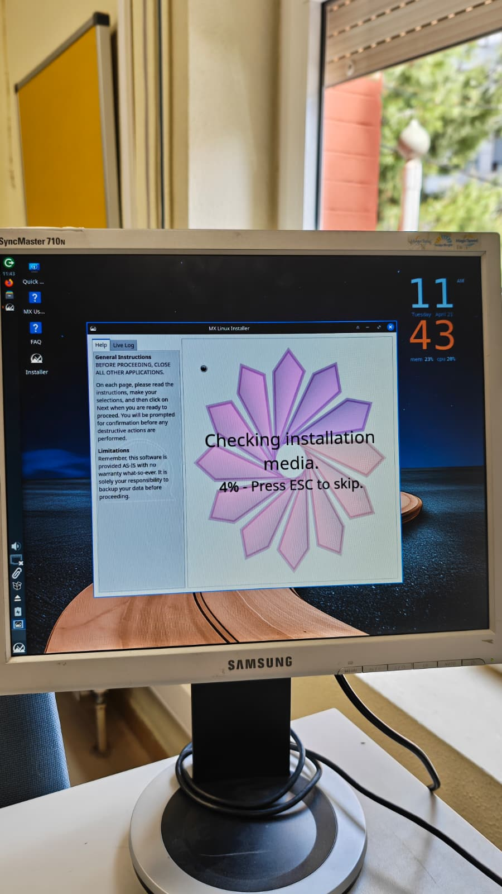 
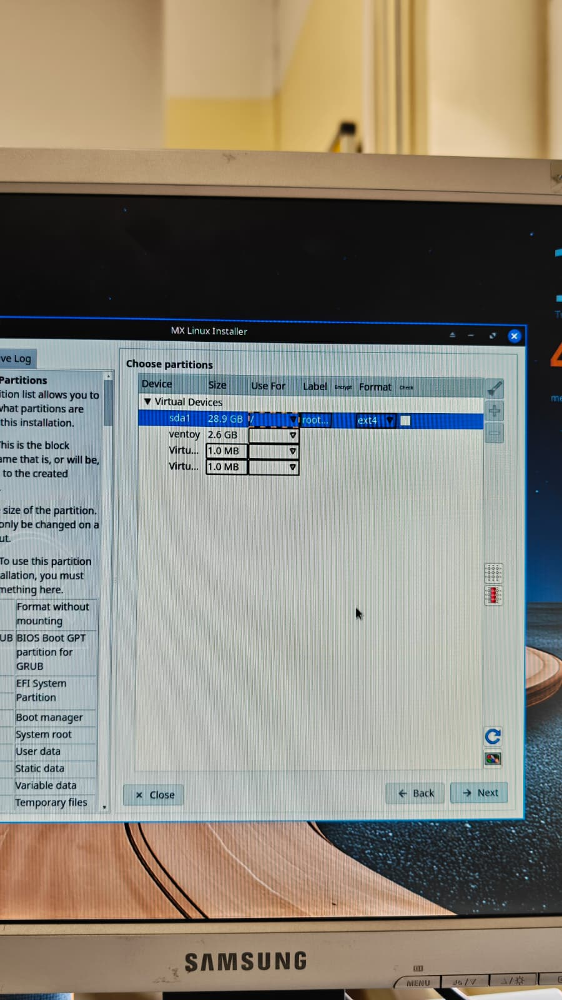 
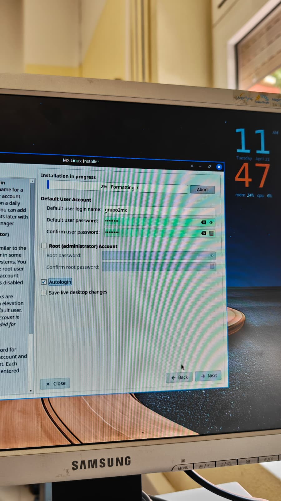 

