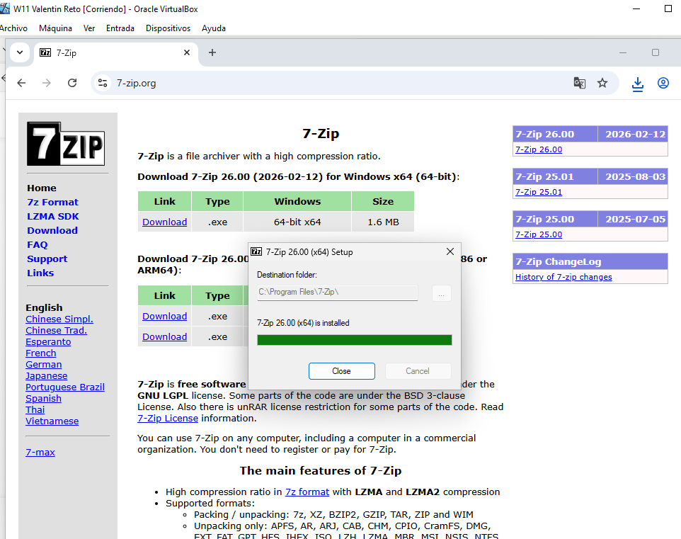
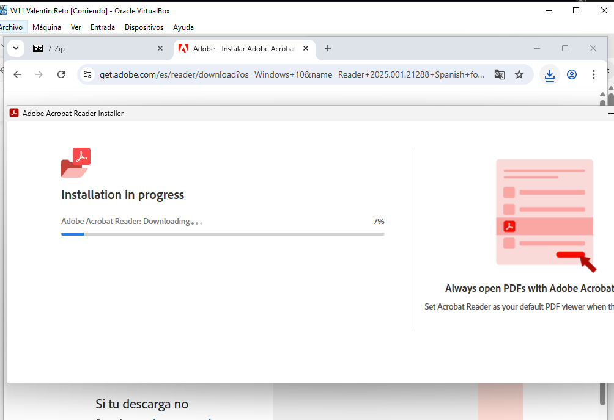
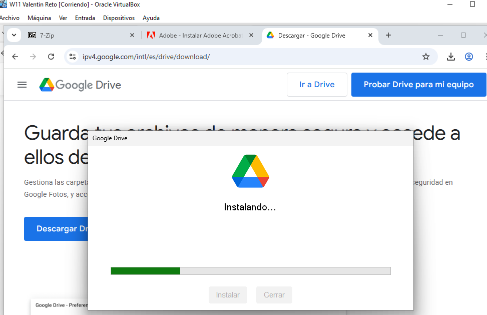

**EJERCICIO 2. Preparación del equipo para uso real en una oficina.**

Debes dejar el equipo listo para que un trabajador pueda utilizarlo en su día a día. 

He elegido chrome como navegador predeterminado por su integración con Google Workspace (Docs, Sheets, Slides). Permite la sincronización de perfiles y el uso de extensiones necesarias para la empresa.
 
He elegido 7-zip por ser Open Source y gratuito para uso profesional. Su formato .7z tiene una mejor comprension, ideal para enviar varios documentos por correo al mismo tiempo.
 
He elegido Adobe Acrobat Reader para garantizar que el empleado pueda visualizar e imprimir documentos facilmente.
 
Y por ultimo Google Drive para Escritorio que lo he elegido para permitir el acceso directo a la nube desde el explorador de Windows. Esto facilita que el usuario trabaje con archivos pesados sin saturar los 4 GB de RAM de la máquina virtual.
 
