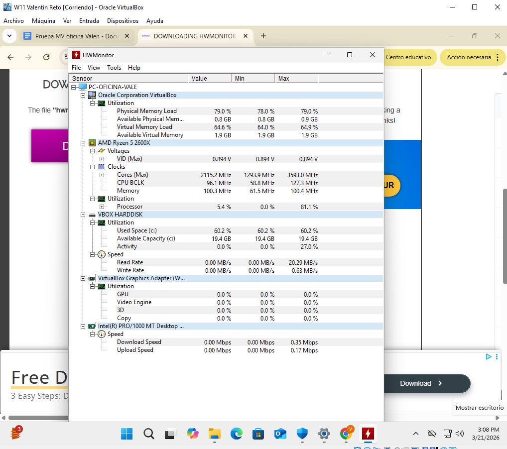
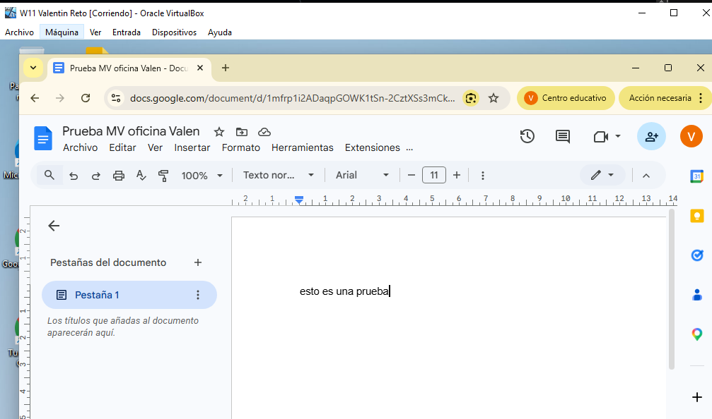
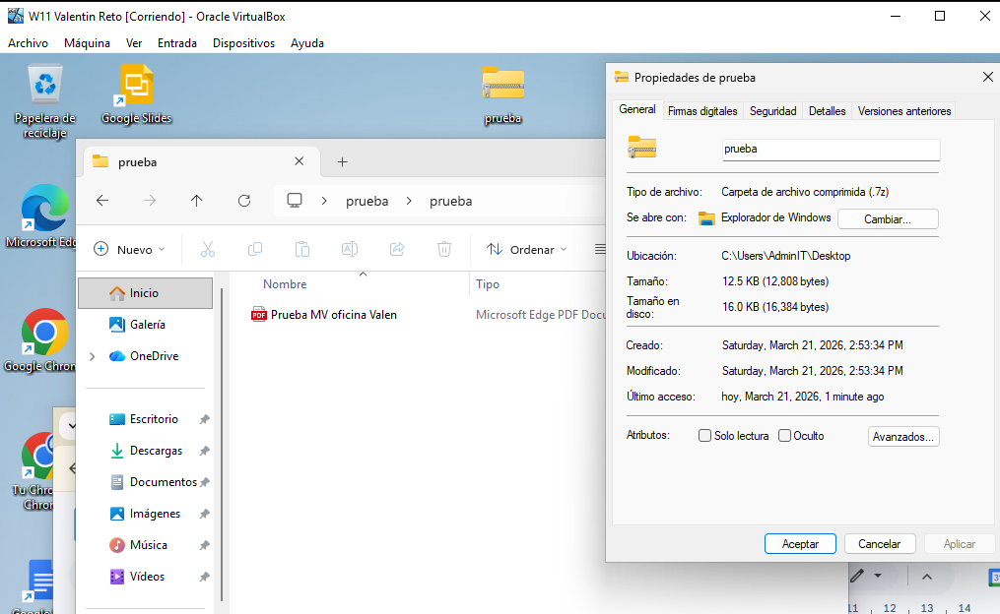

**EJERCICIO 3. Seguridad, mantenimiento, diagnóstico y validación final.**

Una vez preparado el sistema, debes realizar una revisión técnica básica para demostrar que el equipo está listo para ser entregado.

He elegido Microsoft Defender como solución principal de seguridad, lo que ofrece protección en tiempo real con un consumo mínimo de recursos
 
Para el mantenimiento se han instalado las Guest Additions de VirtualBox y se han completado todas las actualizaciones críticas de Windows Update.
 
Para el diagnóstico del hardware he utilizado HWMonitor para verificar que la emulación del procesador y la memoria no presentan cuellos de botella ni errores.
 

Algunas comprobaciones de zip y google doc:
 
 
